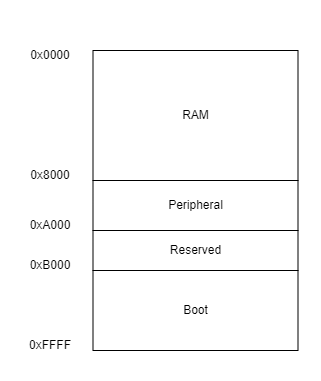
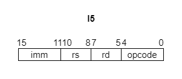

ZKTC は SystemVerilog で実装された 16 ビット CPU です。FPGA で動かすことができます。16 ビットの汎用レジスタが 8 本あります。システムを構成する周辺機能として UART、GPIO を実装しています。また割り込みにも対応しています。

- [特徴](#特徴)
- [メモリマップ](#メモリマップ)
- [レジスタ](#レジスタ)
  - [汎用レジスタ(GR)](#汎用レジスタgr)
  - [コントロールレジスタ(CR)](#コントロールレジスタcr)
    - [PC(Program Counter)](#pcprogram-counter)
    - [SP(Stack Pointer)](#spstack-pointer)
    - [PSR(Processor Status Register)](#psrprocessor-status-register)
    - [TR(Timer Register)](#trtimer-register)
    - [TLR(Timer Low Register)](#tlrtimer-low-register)
    - [THR(Timer High Register)](#thrtimer-high-register)
    - [PPC(Previous Program Counter)](#ppcprevious-program-counter)
    - [PPSR(Previous Processor Status Register)](#ppsrprevious-processor-status-register)
- [命令セット](#命令セット)
  - [R 命令](#r-命令)
  - [I5 命令](#i5-命令)
  - [I8 命令](#i8-命令)
  - [C1 命令](#c1-命令)
  - [C2 命令](#c2-命令)
- [例外](#例外)
  - [リセット](#リセット)
  - [ソフトウェア割り込み(トラップ命令)](#ソフトウェア割り込みトラップ命令)
  - [ハードウェア割り込み](#ハードウェア割り込み)
- [ペリフェラル](#ペリフェラル)

# 特徴

- 16 ビット\*8 本の汎用レジスタ
- アドレス空間 64K バイト
  - Boot 領域は 20K バイト
  - RAM 領域は 32K バイト
- リトルエンディアン

# メモリマップ

# レジスタ

ZKTC の内蔵レジスタは、汎用レジスタとコントロールレジスタの２つに分類されます。

## 汎用レジスタ(GR)

16 ビットのレジスタが 8 本搭載されています。

| 名前 | 説明             |
| ---- | ---------------- |
| zero | 定数値ゼロ       |
| ra   | 戻り値アドレス   |
| fp   | フレームポインタ |
| a0   | 引数/返り値      |
| a1   | 引数             |
| a2   | 引数             |
| t0   | 一時レジスタ     |
| t1   | 一時レジスタ     |

## コントロールレジスタ(CR)

### PC(Program Counter)

16 ビットのレジスタで、次に実行する命令のアドレスを指しています。

### SP(Stack Pointer)

16 ビットのレジスタで、POP 命令/PUSH 命令 で操作するレジスタです。POP 命令 で+2、PUSH 命令 で-2 されます。

### PSR(Processor Status Register)

16 ビットのレジスタで、現在実行中のプロセッサの状態を表しています。

ビット 0 は割り込みの有効、無効を表しています。0 の場合は有効、1 の場合は無効です。割り込みが発生すると 1 にセットされます。

ビット 1 はソフトウェア割り込み(トラップ命令)の有無を表しています。ソフトウェア割り込みにより 1 がセットされます。

ビット 2 はハードウェア割り込みの有無を表しています。ハードウェア割り込みにより 1 がセットされます。

ビット 15 はエミュレータ環境のみリセット時に 1 にセットされています。

### TR(Timer Register)

32 ビットのレジスタで、プロセッサのクロックとともにカウントアップします。

TLR で下位 16 ビット、THR で上位 16 ビットを間接的に操作します。

0xFFFFFFFF の次は 0 になります。

### TLR(Timer Low Register)

16 ビットのレジスタで、TR を操作するために使用します。

### THR(Timer High Register)

16 ビットのレジスタで、TR を操作するために使用します。

### PPC(Previous Program Counter)

16 ビットのレジスタで、割り込みが発生すると自動的に PC からコピーされます。

### PPSR(Previous Processor Status Register)

16 ビットのレジスタで、割り込みが発生すると自動的に PSR からコピーされます。

# 命令セット

ZKTC には 5 つの命令フォーマットがあります。

## R 命令

レジスタ同士の演算を行う命令です。

| Opcode | Function | Instruction            | Mnemonic | Operation                          | Assembly   |
| ------ | -------- | ---------------------- | -------- | ---------------------------------- | ---------- |
| 00000  | 00001    | move data              | MOV      | x[rd] = x[rs]                      | mov rd, rs |
| 00000  | 00010    | add                    | ADD      | x[rd] = x[rd] + x[rs]              | add rd, rs |
| 00000  | 00011    | sub                    | SUB      | x[rd] = x[rd] - x[rs]              | sub rd, rs |
| 00000  | 00100    | and                    | AND      | x[rd] = x[rd] & x[rs]              | and rd, rs |
| 00000  | 00101    | or                     | OR       | x[rd] = x[rd] \| x[rs]             | or rd, rs  |
| 00000  | 00110    | xor                    | XOR      | x[rd] = x[rd] \^ x[rs]             | xor rd, rs |
| 00000  | 00111    | shift left logical     | SLL      | x[rd] = x[rd] << x[rs]             | sll rd, rs |
| 00000  | 01000    | shift right logical    | SRL      | x[rd] = x[rd] >>u x[rs] | srl rd, rs |
| 00000  | 01001    | shift right arithmetic | SRA      | x[rd] = x[rd] >>s x[rs] | sra rd, rs |

## I5 命令

命令の中に即値(Immediate)を 5 ビット取る命令です。

| Opcode | Instruction                     | Mnemonic | Operation                                      | Assembly         |
| ------ | ------------------------------- | -------- | ---------------------------------------------- | ---------------- |
| 00001  | add immediate                   | ADDI     | x[rd] = x[rs] + imm                            | addi rd, rs, imm |
| 00010  | sub immediate                   | SUBI     | x[rd] = x[rs] - imm                            | subi rd, rs, imm |
| 00011  | branch if equal                 | BEQ      | if(x[rd] == x[rs]) PC += sext(imm)             | beq rd, rs, imm  |
| 00100  | branch if not equal             | BNQ      | if(x[rd] != x[rs]) PC += sext(imm)             | bnq rd, rs, imm  |
| 00101  | branch if less than             | BLT      | if(x[rd] <s x[rs]) PC += sext(imm)  | blt rd, rs, imm  |
| 00110  | branch if greater than or equal | BGE      | if(x[rd] >=s x[rs]) PC += sext(imm) | bge rd, rs, imm  |
| 00111  | BLT unsigned                    | BLTU     | if(x[rd] <u x[rs]) PC += sext(imm)  | bltu rd, rs, imm |
| 01000  | BGE unsigned                    | BGEU     | if(x[rd] >=u x[rs]) PC += sext(imm) | bgeu rd, rs, imm |
| 01001  | jump and link register          | JALR     | x[rd] = PC + 2, PC = x[rs] + sext(imm)         | jalr rd, rs, imm |
| 01010  | load half word                  | LH       | x[rd] = sext(M[x[rs] + sext(imm)][7:0])        | lh rd, rs, imm   |
| 01011  | load half word unsigned         | LHU      | x[rd] = {8'b0, M[x[rs] + sext(imm)][7:0]}      | lhu rd, rs, imm  |
| 01100  | load word                       | LW       | x[rd] = M[x[rs] + sext(imm)]                   | lw rd, rs, imm   |
| 01101  | store half word                 | SH       | M[x[rs] + sext(imm)] = x[rd][7:0]              | sh rd, rs, imm   |
| 01110  | store word                      | SW       | M[x[rs] + sext(imm)] = x[rd]                   | sw rd, rs, imm   |

## I8 命令

命令の中に即値(Immediate)を 8 ビット取る命令です。

| Opcode | Instruction               | Mnemonic | Operation                       | Assembly    |
| ------ | ------------------------- | -------- | ------------------------------- | ----------- |
| 10000  | jump and link             | JAL      | x[rd] = PC + 2, PC += sext(imm) | jal rd, imm |
| 10001  | load immediate low 8 bit  | LIL      | x[rd] = {8'b0, imm}             | lil rd, imm |
| 10010  | load immediate high 8 bit | LIH      | x[rd] = {imm ,8'b0}             | lih rd, imm |

## C1 命令

オペランドを取りコントロールレジスタを操作する命令です。

| Opcode | Function | Instruction | Mnemonic | Operation              | Assembly |
| ------ | -------- | ----------- | -------- | ---------------------- | -------- |
| 11110  | 00001    | push        | PUSH     | SP -= 2, M[SP] = x[rd] | push rd  |
| 11110  | 00010    | pop         | POP      | x[rd] = M[SP], SP += 2 | pop rd   |
| 11110  | 00011    | read PC     | RPC      | x[rd] = PC + 2         | rpc rd   |
| 11110  | 00100    | read SP     | RSP      | x[rd] = SP             | rsp rd   |
| 11110  | 00101    | read PSR    | RPSR     | x[rd] = PSR            | rpsr rd  |
| 11110  | 00110    | read TLR    | RTLR     | x[rd] = TLR            | rtlr rd  |
| 11110  | 00111    | read THR    | RTHR     | x[rd] = THR            | rthr rd  |
| 11110  | 01000    | read PPC    | RPPC     | x[rd] = PPC            | rppc rd  |
| 11110  | 01001    | read PPSR   | RPPSR    | x[rd] = PPSR           | rppsr rd |
| 11110  | 01010    | write SP    | WSP      | SP = x[rd]             | wsp rd   |
| 11110  | 01011    | write PSR   | WPSR     | PSR = x[rd]            | wpsr rd  |
| 11110  | 01100    | write TLR   | WTLR     | TLR = x[rd]            | wtlr rd  |
| 11110  | 01101    | write THR   | WTHR     | THR = x[rd]            | wthr rd  |
| 11110  | 01110    | write PPC   | WPPC     | WPPC = x[rd]           | wppc rd  |
| 11110  | 01111    | write PPSR  | WPPSR    | WPPSR = x[rd]          | wppsr rd |

## C2 命令

コントロールレジスタを操作する命令です。

| Opcode | Function | Instruction                         | Mnemonic | Operation            | Assembly |
| ------ | -------- | ----------------------------------- | -------- | -------------------- | -------- |
| 11111  | 00001    | copy PPC to PC and copy PPSR to PSR | RFI      | PC = PPC, PSR = PPSR | rfi      |
| 11111  | 00010    | read TR                             | RTR      | {THR, TLR} = TR      | rtr      |
| 11111  | 00011    | write TR                            | WTR      | TR = {THR, TLR}      | wtr      |

# 例外

例外にはリセット、ソフトウェア割り込み(トラップ命令)、ハードウェア割り込みの 3 種類あります。

リセットは常に実行されますが、ソフトウェア割り込みやハードウェア割り込みは PSR のビット 0 が 1 にセットされている場合はマスク(無効化)されます。

## リセット

RES が High に変化すると直ちに開始します。動作は以下の通りです。

1. CPU や周辺モジュールのレジスタが初期化されます。
2. PC が 0xB000(Boot RAM の先頭)にセットされ、実行を開始します。

## ソフトウェア割り込み(トラップ命令)

トラップ命令の実行により開始されます。動作は以下の通りです。

1. 実行時の PC(トラップ命令の次の命令を指している) を PPC、PSR を PPSR にコピーします。
2. PSR のビット 0 が 1 にセットされます。
3. PC が 0x0000(RAM の先頭)にセットされ、実行を開始します。

トラップ命令はビットパターンがすべて 0 かすべて 1 の命令です。

## ハードウェア割り込み

# ペリフェラル

ZKTC にはペリフェラルとして LED、UART、GPIO が実装されていて、MMIO で操作することができます。

| Address | Function                                                                                        | R/W |
| ------- | ----------------------------------------------------------------------------------------------- | --- |
| 0x8000  | 最下位ビットから順に LED0,1,2,3 の状態 (下位 4 ビット)  0 : off 1 : on                       | W   |
| 0x8100  | UART の送信状態 (下位 1 ビット)  0 : not busy 1 : busy                                       | R   |
| 0x8102  | UART の送信開始 (下位 1 ビット)  0 : not start 1 : start (下位 1 ビット)                     | W   |
| 0x8104  | UART の送信データ (下位 8 ビット)                                                               | W   |
| 0x8110  | UART の受信状態 (下位 1 ビット)  0 : not busy 1 : busy                                       | R   |
| 0x8112  | UART の受信時の割り込み (下位 1 ビット)  0 : disable 1 : enable                              | W   |
| 0x8114  | UART の受信データが有効か (下位 1 ビット)  0 : invalid 1 : valid                             | R   |
| 0x8116  | UART の受信データ (下位 8 ビット)                                                               | R   |
| 0x8200  | 最下位ビットから順に GPIO0,1,2,3,4,5,6,7 の出力 (下位 8 ビット)   0 : low 1 : high           | W   |
| 0x8202  | 最下位ビットから順に GPIO0,1,2,3,4,5,6,7 の入力 (下位 8 ビット)   0 : low 1 : high           | R   |
| 0x8204  | 最下位ビットから順に GPIO0,1,2,3,4,5,6,7 の入出力方向 (下位 8 ビット)   0 : output 1 : input | W   |
